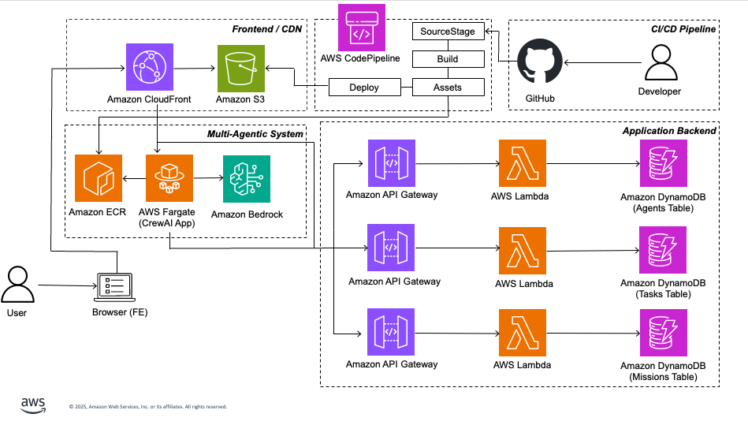

# Amazon Bedrock & CrewAI Multi-Agent Builder

**Build powerful AI agent teams without code** — A comprehensive platform that transforms how you create and orchestrate multi-agent AI systems using Amazon Bedrock and CrewAI.

Empower specialized AI agents to collaborate seamlessly on complex tasks, from content creation to code generation and visual design. Whether you're a developer, content creator, or business professional, harness the full potential of foundation models like Claude 3 Haiku and Stability AI's Stable Image Ultra through an intuitive visual interface.

## Key Features

**Multi-Agent Orchestration**  
Deploy specialized agents with distinct roles that collaborate intelligently to tackle complex, multi-step challenges

**Amazon Bedrock Integration**  
Access cutting-edge foundation models including Claude 3 Haiku for advanced reasoning and Stability AI's Stable Image Ultra for stunning visual generation

**CrewAI Framework**  
Leverage industry-leading agent coordination and workflow management for seamless team collaboration

**No-Code Visual Interface**  
Create, configure, and monitor agent missions through an intuitive web interface — no programming required

**Serverless AWS Architecture**  
Deploy instantly on AWS with automatic scaling, high availability, and enterprise-grade security

## Demo & Ready-to-Use Examples

https://github.com/user-attachments/assets/eeeeb56e-aa1f-4910-a91b-c267453ea8a1

### Pre-Built Mission Templates

**Newsletter Creation**  
Collaborative content generation with specialized agents for event ideas, copywriting, and marketing strategies

**Game Code Generation**  
Multi-step game development process from design prompt to functional, playable code

**NPC Character Creation**  
Complete game character development with specialized agents for character design, dialogue writing, attribute definition, and AI-generated visual representation using Stability AI's Stable Image Ultra

---

## Architecture

<div align="center">
  
</div>

### User Flow

1. **Frontend Interface** - Users interact with a React-based web interface hosted on Amazon S3 and distributed via Amazon CloudFront. The UI provides no-code creation and management of agents, missions, and tasks.

2. **API Layer** - Amazon API Gateway routes requests to AWS Lambda functions that handle CRUD operations for agents, missions, and tasks stored in Amazon DynamoDB tables.

3. **Agent Orchestration** - When users execute missions, requests are routed through CloudFront to a CrewAI application running on AWS Fargate. This containerized service orchestrates multi-agent workflows and coordinates agent interactions.

4. **AI Foundation Models** - The Fargate-hosted CrewAI application connects to Amazon Bedrock to access foundation models: Claude 3 Haiku for text generation and reasoning, and Stability AI's Stable Image Ultra for image generation. Agents use specialized tools for code interpretation and image generation to complete complex tasks.

---

## Prerequisites

### Required Tools

- **[AWS CDK](https://docs.aws.amazon.com/cdk/v2/guide/getting_started.html)** `>= 2.1005.0`
- **[Node.js](https://nodejs.org/en)** `>= 16.x`
- **[npm](https://www.npmjs.com/get-npm)** `>= 8.x`
- **[Python](https://www.python.org/downloads/)** `>= 3.9`
- **[Poetry](https://python-poetry.org/docs/#installation)** `>= 1.4.0` for Python dependency management
- **[Docker](https://www.docker.com/get-started)** `>= 20.10.x` *(optional, for local container testing)*

### AWS Model Access

In your AWS Account in **us-west-2**, ensure the following models are enabled in Amazon Bedrock by [adding model access](https://docs.aws.amazon.com/bedrock/latest/userguide/model-access.html#model-access-add):

- **Anthropic Claude 3 Haiku**
- **Stability AI's Stable Image Ultra V1**

---

## Project Setup

### 1. AWS Connection Setup & Context File Creation

1. **Fork this repository**

2. **Create a GitHub connection** for CI/CD integration in the [AWS Console](https://docs.aws.amazon.com/dtconsole/latest/userguide/connections-create-github.html)

3. **Configure your project** by creating a `cdk.context.json` file in the root directory:
   ```json
   {
     "account": "YOUR_AWS_ACCOUNT_ID",
     "region": "us-west-2",
     "connection": "YOUR_GITHUB_CONNECTION_ARN",
     "user": "YOUR_GITHUB_USERNAME",
     "repo": "sample-multi-agent-builder-bedrock-crewai",
     "branch": "main"
   }
   ```

### 2. Installing Dependencies

**CDK Infrastructure Dependencies**
```bash
npm install
```

**UI Dependencies & Build**
```bash
cd ui
npm install
npm run build
```

**Python Dependencies**
```bash
cd ../agents-api
poetry install
```

### 3. Project Deployment

**Bootstrap AWS Environment** *(first-time setup)*
```bash
cdk bootstrap
```

**Deploy Infrastructure**
```bash
npm run build
cdk deploy
```

**Pipeline Deployment** *(~15 minutes)*  
The deployment creates a `MultiAgentToolchainStack` which provisions a CodePipeline called `MultiAgentProjectPipeline`. Once complete, find your application URL in the `Deploy-MultiAgentProjectStack` CloudFormation Stack outputs.

**Access Your Application**  
Visit the `Deploy-MultiAgentProjectStack` Stack → **Outputs Tab** → Click the `UIUrl` link

---

## Local Development *(Optional)*

### UI Development
```bash
cd ui
npm start
```
*Available at http://localhost:3000/*

### CrewAI API Development
```bash
cd agents-api
python3 -m venv venv
source venv/bin/activate  # Linux/macOS
# OR
.\venv\Scripts\activate   # Windows

poetry install
poetry run uvicorn main:app --reload --workers 7
```
*Available at http://127.0.0.1:8000/*

### Container Testing
```bash
docker build -t multi-agent:1 .
docker run -p 8000:8000 multi-agent:1
```
*Available at http://localhost:8000/*

---

## Project Structure

```
├── agents-api/             # CrewAI backend service
│   ├── tools/              # Custom agent tools (image gen, code interpreter)
│   ├── main.py             # FastAPI application & CrewAI orchestration
│   ├── Dockerfile          # Container configuration
│   └── pyproject.toml      # Python dependencies
├── ui/                     # React frontend application
├── lib/                    # AWS CDK infrastructure code
├── lambdas/                # AWS Lambda functions
├── bin/                    # CDK app entry point
└── cdk.json                # CDK configuration
```

---

## Cleanup

**Remove All Resources**
```bash
cdk destroy
```

**Manual Cleanup Steps:**
1. Delete `Deploy-MultiAgentProjectStack` from CloudFormation console
2. Empty and delete S3 bucket starting with `multiagenttoolchainstack-`

---

## FAQ

### How do I make changes after deployment?

This project uses **AWS CodePipeline** for continuous integration:
- Push changes to your repository → automatic pipeline trigger
- The `MultiAgentProjectPipeline` handles building, testing, and deploying
- No manual redeployment needed!

### UI updates not showing?

Clear CloudFront cache:
```bash
aws cloudfront create-invalidation \
    --distribution-id YOUR_DISTRIBUTION_ID \
    --paths "/*"
```

---

## Security

See [CONTRIBUTING](CONTRIBUTING.md#security-issue-notifications) for more information.

## License

This library is licensed under the MIT-0 License. See the LICENSE file.
